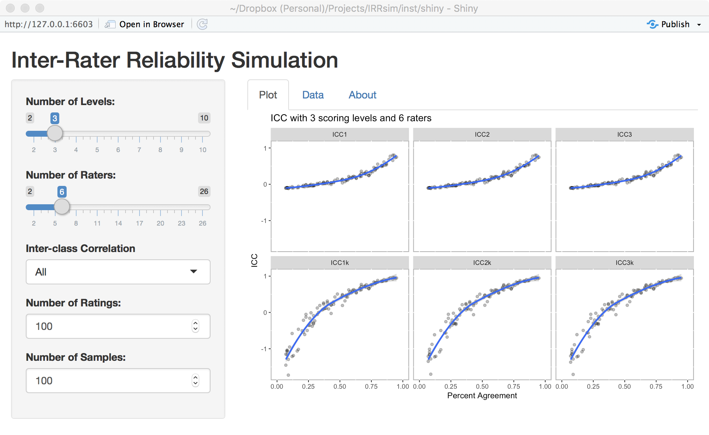

# `IRRsim`: An R Package for Simulating Inter-Rater Reliability

This package provides functions and a shiny application to simulate inter-rater 
reliability statistics based on various scoring and response models. The initial motivation for 
this package is to understand the relationship between percent rater agreement and interclass correlation.

Documentation is available at http://irrsim.bryer.org

## Install

The development version of `IRRsim` can be downloaded from Github using the `devtools` package:

```
devtools::install_github('jbryer/IRRsim')
```

## Shiny App

Many of features of this package can be explored using the included shiny applications. The `IRRsim_shiny()` function will run the application.

```
IRRsim::IRRsim_shiny()
```



