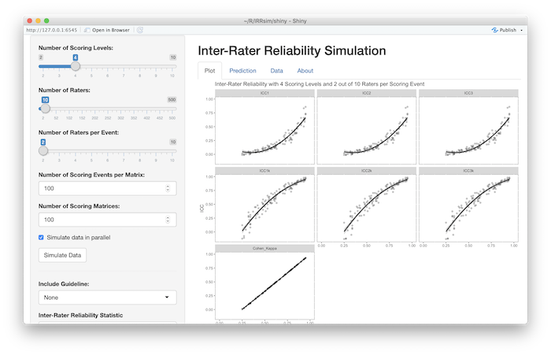

```{r setup, include=FALSE}
knitr::opts_chunk$set(echo = TRUE, 
					  warning = FALSE, 
					  message = FALSE, 
					  fig.width = 10,
					  fig.height = 6)

library(magrittr)
library(IRRsim)
library(knitr)

set.seed(2112)

linebreak <- "<br/>"
```


## Measuring Inter-rater Reliability

Percent Rater Agreement (PRA)

* Percentage of scoring events where raters' scores agree.

Intraclass Correlation (ICC)

* ICC is a quantitative measurements are made on units that are organized into groups. It describes how strongly units in the same group resemble each other

Cohen's Kappa

* Measure of agreement between two raters that takes into account agreement by chance.

Fleiss' Kappa

* Extension of Cohen's kappa for more than two raters. It also takes into account agreement by chance.

## Components of Measuring IRR

Models:

* **One-way random** effects: each subject is measured by a different set of k randomly selected raters.
* **Two-way random** effects: k raters are randomly selected, then, each subject is measured by the same set of k raters.
* **Two-way mixed** effects: k fixed raters are defined. Each subject is measured by the k raters.

Number of measurements:

* **Single measures**: even though more than one measure is taken in the experiment, reliability is applied to a context where a single measure of a single rater will be performed.
* **Average measures**: the reliability is applied to a context where measures of k raters will be averaged for each subject.

Consistency or absolute agreement:

* **Absolute agreement**: the agreement between two raters is of interest, including systematic errors of both raters and random residual errors.
* **Consistency**: in the context of repeated measurements by the same rater, systematic errors of the rater are canceled and only the random residual error is kept.


## 


| IRR Statistic     | Description           | Formula                           |
|:------------------|:----------------------|:---------------------------------:|
| Percent Agreement | One-way random effects; Absolute agreement    | $\frac{number\ of\ observations\ agreed\ upon}{total\ number\ of\ observations}$ |
| ICC(1,1)          | One-way random effects; absolute agreement; single measurements | $\frac{MS_R - MS_W}{MS_R + (k - 1)MS_W}$ |
| ICC(2,1)          | Two-way random effects; absolute agreement; single measures | $\frac{MS_R - MS_W}{MS_R + (k - 1)MS_E + \frac{k}{n}(MS_C - MS_E)}$ |
| ICC(3,1)          | Two-way random mixed effects; consistency; single measures. | $\frac{MS_R - MS_E}{MS_R + (k-1)MS_E}$ |
| ICC(1,*k*)        | One-way random effects; absolute agreement; average measures. | $\frac{MS_R - MS_W}{MS_R}$ |
| ICC(2,*k*)        | Two-way random effects; absolute agreement; average measures. | $\frac{MS_R - MS_E}{MS_R | \frac{MS_C - MS_E}{n}}$ |
| ICC(3,*k*)        | Two-way mixed effects; consistency; average measures. | $\frac{MS_R - MS_E}{MS_R}$ |
| Cohen's Kappa (κ) | Absolute agreement    | $\frac{P_o - P_e}{1 - P_e}$ |

<font size="3">*Note.* $MS_R$ = mean square for rows; $MS_W$ = mean square for risudal sources of variance; $MS_E$ = mean square error; $MS_C$ = mean square for columns; $P_o$ = observed agreement rates; $P_e$ = expected agreement rates.</font>


## Guidelines for Interpreting IRR {.columns-2 }

<font size = "3">
```{r IRRguidelines, echo=FALSE, results='asis'}
data("IRRguidelines")
for(i in IRRguidelines[1:7]) {
	cat(paste0("", i$reference, ' (<b>', ifelse(any(is.na(i$metrics)), 'Not specified', paste0(i$metrics, collapse=', ')), "</b>)\n"))
	cat(paste0("<li>&lt; ", i$breaks[2], ' ', names(i$breaks)[1]), '</li>\n')
	if(length(i$breaks) > 2) {
		for(j in seq(2, length(i$breaks) - 1)) {
			cat(paste0("<li>", i$breaks[j], ' - ', i$breaks[j+1], ' ', names(i$breaks)[j]), '</li>\n')
		}
	}
	cat(paste0("<li> &gt;", i$breaks[length(i$breaks)], ' ', names(i$breaks[length(i$breaks)]), '</li>\n'))
	cat('\n\n')
}
```

</font>

## Guidelines for Interpreting IRR

```{r IRRguidelinesPlot, echo=FALSE, fig.height=4.5, fig.width=10}
guidelines <- data.frame()
for(i in IRRguidelines) {
	guidelines <- rbind(guidelines, data.frame(
		Reference = i$reference,
		Description = names(i$breaks),
		Metric = ifelse(any(is.na(i$metrics)), 'Not specified', i$metrics[1]),
		Value = unname(i$breaks),
		stringsAsFactors = FALSE
	))
}
guidelines$Reference <- gsub('; ', '\n', guidelines$Reference)
guidelines[guidelines$Description == 'Reasonable for clinical measurement',]$Description <- 'Reasonable for\nclinical measurement'
ggplot(guidelines, aes(x = Reference, y = Value, label = Description)) + 
	geom_point(shape = 17) + 
	geom_text(vjust = -1.5, size = 3.5) +
	geom_text(data=guidelines[guidelines$Value > 0,],
							  aes(label = Value), hjust = -0.4, size = 3) +
	facet_wrap(~ Metric, nrow = 1, scales = "free_x") +
	ylim(c(0, 1)) +
	ylab("IRR Value") +
	# ggtitle('Guidelines for Interpreting IRR') +
	theme(axis.text.x = element_text(size = 7))
```

## Guidelines for Education

In education, ICC1 is *often* the most appropriate intra-class correlation (ICC) metric to use given each subject is measured by two randomly selected raters (one-way), single measures are used, and absolute agreement is desired.

Guidelines for interpreting ICC is largely provided from the medical literature. When discussing to ICC1, Koo and Li (2016) state that "practically, this model is rarely used in clinical reliability analysis because majority of the reliability studies typically involve the same set of raters to measure all subjects" (pp. 156-157).

The guidelines for interpreting ICC may not be appropriate for all forms of ICC. As will be shown, the magnitude of the ICC vary greatly for the same percent agreement.

## The IRRsim R Package

The `IRRsim` package provides functions to simulate various scoring situations.

```{r, eval = FALSE}
devtools::install_github('jbryer/IRRsim')
```

```{r, message=FALSE, warning=FALSE}
library(IRRsim)
```

Key functions:

* `simulateRatingMatrix` - Simulate a single rating matrix.
* `simulateIRR` - Simulates many scoring matrices with varying percent rater agreements. S3 methods implemented for objects returned by `simulateIRR`:
	* `summary`
	* `plot`
	* `as.data.frame`
* `IRRsim_demo` - Run interactive Shiny application.

## `simulateRatingMatrix`

Simulate a single rating matrix. 

For each scoring event (i.e. row within a scoring matrix):

1. One of *k* raters is randomly selected.
2. A score, *y*, is randomly selected from the response distribution (uniform distribution by default)
3. A random number, *x*, between 0 and 1 is generated. 
	* If *x* is less than the specified desired percent agreement, the remaining values in the row are set to *y*.
	* Otherwise, scores for the remaining raters are randomly selected from the response distribution.
4. Repeat steps 1 through 3 for the remaining scoring events.
5. If $k_n < k$, then $k - k_n$ scores per row are set to `NA` (missing).


## Simulating Scoring Matrices { .columns-2 }

```{r testdata1, message=FALSE, warning=FALSE}
set.seed(2112)
test1 <- simulateRatingMatrix(
	nLevels = 3, k = 6, k_per_event = 6,
	agree = 0.6, nEvents = 10)
test1
agreement(test1)
```

```{r testdata2, message=FALSE, warning=FALSE}
set.seed(2112)
test2 <- simulateRatingMatrix(
	nLevels = 3, k = 6, k_per_event = 2,
	agree = 0.6, nEvents = 10)
test2
agreement(test2)
```

## `simulateIRR`

Simulates many scoring matrices with varying percent rater agreements. For each scoring matrix, IRR statistics are calculated. This functions returns an object of type `IRRsim` which has S3 methods defined for `plot`, `summary`, and `as.data.frame`.

For the remainder of the document, we wish to estimate ICC for 6, 9, and 12 raters under the conditions of 3, 5, and 9 scoring levels.

```{r simulate, cache = TRUE, message = FALSE, warning = FALSE, results = 'hide'}
tests.3levels <- simulateIRR(nRaters = c(6, 9, 12), nRatersPerEvent = 2, nLevels = 3)
tests.5levels <- simulateIRR(nRaters = c(6, 9, 12), nRatersPerEvent = 2, nLevels = 5)
tests.9levels <- simulateIRR(nRaters = c(6, 9, 12), nRatersPerEvent = 2, nLevels = 9)
```

## {.centered}

```{r ploticc3, echo = FALSE, fig.width = 10, fig.height = 6}
plot(tests.3levels, stat = 'ICC1') + ylim(c(-0.2, 1.0))
```


## {.centered}

```{r ploticc5, echo = FALSE, fig.width = 10, fig.height = 6}
plot(tests.5levels, stat = 'ICC1') + ylim(c(-0.2, 1.0))
```

## {.centered}

```{r ploticc9, echo = FALSE, fig.width = 10, fig.height = 6}
plot(tests.9levels, stat = 'ICC1') + ylim(c(-0.2, 1.0))
```

##

```{r}
tests.3levels.sum <- summary(tests.3levels, stat = 'ICC1', method = 'quadratic')
summary(tests.3levels.sum$model[[1]]) # k = 6 raters
```

**`r round(summary(tests.3levels.sum$model[[1]])$r.squared * 100)`% of the variance in ICC1 is accounted for by percent agreement!**

## Simulating Different Response Distributions

```{r simulate2, cache = TRUE, message = FALSE, warning = FALSE, results = 'hide'}
# Uniform response distribution
test1.3levels <- simulateIRR(nRaters = c(6, 9, 12), nRatersPerEvent = 2, nLevels = 3, 
							 response.probs = c(.33, .33, .33))
# Lightly skewed response distribution
test4.3levels <- simulateIRR(nRaters = c(6, 9, 12), nRatersPerEvent = 2, nLevels = 3, 
							 response.probs = c(.275, .275, .45))
# Moderately skewed response distributions
test2.3levels <- simulateIRR(nRaters = c(6, 9, 12), nRatersPerEvent = 2, nLevels = 3, 
							 response.probs = c(.2, .2, .6))
# Highly skewed response distributions
test3.3levels <- simulateIRR(nRaters = c(6, 9, 12), nRatersPerEvent = 2, nLevels = 3, 
							 response.probs = c(.1, .1, .8))
```

```{r, echo = FALSE, results = 'hide'}
test1.3levels.df <- as.data.frame(test1.3levels)
test2.3levels.df <- as.data.frame(test2.3levels)
test3.3levels.df <- as.data.frame(test3.3levels)
test4.3levels.df <- as.data.frame(test4.3levels)
# Combine the different response distributions
test1.3levels.df$ResponseDist <- 'Uniform'
test2.3levels.df$ResponseDist <- 'Moderately Skewed'
test3.3levels.df$ResponseDist <- 'Highly Skewed'
test4.3levels.df$ResponseDist <- 'Ligthly Skewed'
test.3levels.df <- rbind(test1.3levels.df, test2.3levels.df, test3.3levels.df, test4.3levels.df)
```

<div class="columns-2">

Uniform Distribution

```{r, echo = FALSE}
sapply(test1.3levels, FUN = function(x) { as.integer(x$data) }) %>%
	unlist %>% table %>% prop.table
```

Lightly Skewed

```{r, echo = FALSE}
sapply(test4.3levels, FUN = function(x) { as.integer(x$data) }) %>%
	unlist %>% table %>% prop.table
```

<br /><br />

Moderately Skewed

```{r, echo = FALSE}
sapply(test2.3levels, FUN = function(x) { as.integer(x$data) }) %>%
	unlist %>% table %>% prop.table
```

Highly Skewed

```{r, echo = FALSE}
sapply(test3.3levels, FUN = function(x) { as.integer(x$data) }) %>%
	unlist %>% table %>% prop.table
```

</div>

## {.centered}

```{r ploticcresponsedist, echo = FALSE, fig.width = 10, fig.height = 6}
guide <- data.frame(
	labels = paste0(names(IRRguidelines[['Cicchetti']]$breaks[-1]), ' (',
					unname(IRRguidelines[['Cicchetti']]$breaks[-1]), ')'),
	y = unname(IRRguidelines[['Cicchetti']]$breaks[-1]),
	stringsAsFactors = FALSE
)
ggplot(test.3levels.df, aes(x = agreement, y = ICC1, color = ResponseDist)) +
	geom_hline(yintercept = c(0.4, 0.6, 0.75), alpha = 0.5) +
	geom_text(data = guide, color = 'black', linetype = 1, hjust = 0, vjust = -0.5,
			  aes(label = labels, y = y, x = 0)) +
	geom_smooth(method = 'loess', se = FALSE, aes(linetype = factor(k))) +
	scale_linetype('n Raters') +
	xlab('Percent Agreement') +
	ggtitle('ICC1 vs Percent Agreement',
			subtitle = "Cicchetti's Guidelines Provided")
```

## Modeling ICC from Percent Agreement

```{r, echo=FALSE}
data("IRRsimData")
levels(IRRsimData$nLevels) <- c('Two', 'Three', 'Four', 'Five')
IRRsimData$nLevels <- as.character(IRRsimData$nLevels)
levels(IRRsimData$k) <- c('Two', 'Four', 'Eight', 'Sixteen')
IRRsimData$k <- as.character(IRRsimData$k)
```

Simulated `r prettyNum(nrow(IRRsimData), big.mark = ',')` scoring matrices (each 100 x *k*) with *k* between 2 and 16 raters and four response distributions (i.e. uniform, lightly skewed, moderately skewed, and highly skewed).

```{r}
icc1.out <- lm(ICC1 ~ nLevels + k + agreement + I(agreement^2) + MaxResponseDiff,
			   data = IRRsimData)
icc2.out <- lm(ICC2 ~ nLevels + k + agreement + I(agreement^2) + MaxResponseDiff,
			   data = IRRsimData)
icc3.out <- lm(ICC3 ~ nLevels + k + agreement + I(agreement^2) + MaxResponseDiff,
			   data = IRRsimData)
icc1k.out <- lm(ICC1k ~ nLevels + k + agreement + I(agreement^2) + MaxResponseDiff,
				data = IRRsimData)
icc2k.out <- lm(ICC2k ~ nLevels + k + agreement + I(agreement^2) + MaxResponseDiff,
				data = IRRsimData)
icc3k.out <- lm(ICC3k ~ nLevels + k + agreement + I(agreement^2) + MaxResponseDiff,
				data = IRRsimData)
```


## 

```{r, echo=FALSE, results='asis'}
df.summary <- rbind(
	c('r-squared' = summary(icc1.out)$r.squared, icc1.out$coefficients),
	c('r-squared' = summary(icc2.out)$r.squared, icc2.out$coefficients),
	c('r-squared' = summary(icc3.out)$r.squared, icc3.out$coefficients),
	c('r-squared' = summary(icc1k.out)$r.squared, icc1k.out$coefficients),
	c('r-squared' = summary(icc2k.out)$r.squared, icc2k.out$coefficients),
	c('r-squared' = summary(icc3k.out)$r.squared, icc3k.out$coefficients)
)
row.names(df.summary) <- c('ICC1', 'ICC2', 'ICC3', 'ICC1k', 'ICC2k', 'ICC3k')
knitr::kable(t(df.summary), digits = 2)
```

## Shiny Application

An interactive Shiny web application was developed to facilitate the simulation of scoring matrices for any particular scoring design.

```{r, eval = FALSE}
IRRsim_demo()
```

<div class='centered'>



</div>

## Discussion

* ICC and percent agreement are highly correlated with percent agreement account for approximately 90% of the variance in ICC.
* Skewness in the response distribution does not appear to impact ICC. This may not be desirable. As one score increases in likelihood (say, response C in four possible scores), agreement by chance of the raters should also increase. ICC, which is suppose to account for agreement-by-chance, does not for this situation.
* When $k_n = 2$, there is a penalty in ICC as *k* increases.
* The published guidelines for interpreting ICC may not be appropriate for one-way designs (i.e. ICC1 and ICC1k). For many common scoring designs (e.g. $k_n = 2$, $k > 20$) in education, achieving "excellent" inter-rater reliability is not possible.
* The Shiny web application is a tool to help researchers interpret their ICC results in relation to the percent agreement achieved.

### Recommendations

* Researchers should report their full scoring design including $k$, $k_n$, and number of scoring levels.
* Report/utilize percent agreement. This metric is much more understandable. 
