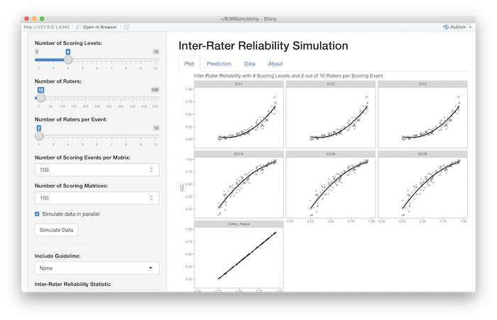

```{r setup, include=FALSE}
knitr::opts_chunk$set(
  collapse = TRUE,
  comment = "#>",
  echo = TRUE,
  message = FALSE,
  warning = FALSE,
  error = FALSE, 
  fig.width=7.5, 
  fig.height=4.5
)
options(scipen=1, digits=2)
library(IRRsim)
library(ggplot2)
set.seed(2112) # For reproducibility
output.type <- 'html' # html or latex
ggplot2::theme_set(theme_bw())

# data("IRRsimData", package = "IRRsim")
if(file.exists('../data-releases/IRRsimData.rda')) {
	load('../data-releases/IRRsimData.rda')
} else {
	tmpfile <- tempfile()
	download.file('https://github.com/jbryer/IRRsim/releases/download/IRRsimData/IRRsimData.rda', tmpfile)
	load(tmpfile)
}

linebreak <- switch(output.type,
					html = "<br>",
					latex = "\n"
)
```


When raters are involved in scoring procedures, inter-rater reliability (IRR) measures are used to establish the reliability of instruments. Commonly used IRR measures include Percent Agreement, Intraclass Correlation Coefficient (ICC) and Cohen's Kappa (see Table 1). Several researchers recommend using ICC and Cohen's Kappa over Percent Agreement (Hallgren, 2012; Koo & Li, 2016; McGraw & Wong, 1996; Shrout & Fleiss, 1979). Although it may appear that IRR measures are interchangeable, they reflect different information (AERA, NCME, & APA, 2014). For instance, Cohen's Kappa and Percent Agreement reflect absolute agreement, while ICC (3, 1) reflect consistency between the raters (see Table XX). Inter-rater reliability is defined differently in terms of either consistency, agreement, or a combination of both. Yet, there are misconceptions and inconsistencies when it comes to proper application, interpretation and reporting of these measures (Kottner et al., 2011; Trevethan, 2017).  In addition, researchers tend to recommend different thresholds for poor, moderate and good level of reliability (see Table 2). These inconsistencies, and the paucity of detailed reports of test methods, research designs and results perpetuate the misconceptions in the application and interpretation of IRR measures. 


Table 1. *Descriptions and formulas of IRR measures*

| IRR Statistic     | Description           | Formula                           |
|:------------------|:----------------------|:---------------------------------:|
| Percent Agreement | One-way random effects; Absolute agreement    | $\frac{number\ of\ observations\ agreed\ upon}{total\ number\ of\ observations}$ |
| ICC(1,1)          | One-way random effects; absolute agreement; single measurements | $\frac{MS_R - MS_W}{MS_R + (k - 1)MS_W}$ |
| ICC(2,1)          | Two-way random effects; absolute agreement; single measures | $\frac{MS_R - MS_W}{MS_R + (k - 1)MS_E + \frac{k}{n}(MS_C - MS_E)}$ |
| ICC(3,1)          | Two-way random mixed effects; consistency; single measures. | $\frac{MS_R - MS_E}{MS_R + (k-1)MS_E}$ |
| ICC(1,*k*)        | One-way random effects; absolute agreement; average measures. | $\frac{MS_R - MS_W}{MS_R}$ |
| ICC(2,*k*)        | Two-way random effects; absolute agreement; average measures. | $\frac{MS_R - MS_E}{MS_R | \frac{MS_C - MS_E}{n}}$ |
| ICC(3,*k*)        | Two-way mixed effects; consistency; average measures. | $\frac{MS_R - MS_E}{MS_R}$ |
| Cohen's Kappa (κ) | Absolute agreement    | $\frac{P_o - P_e}{1 - P_e}$ |

*Note.* $MS_R$ = mean square for rows; $MS_W$ = mean square for residual sources of variance; $MS_E$ = mean square error; $MS_C$ = mean square for columns; $P_o$ = observed agreement rates; $P_e$ = expected agreement rates.

### Percent Agreement

Percent agreement is the reliability statistic obtained by dividing number of observations agreed upon to the total number of observations. It is easy to compute and interpret, and 70% agreement is considered as the minimum acceptable level. Yet, percent agreement is criticized due to chance agreement (Hartmann, 1977), i.e., the proportion of agreements when the observers' ratings are unrelated. Cohen's Kappa is perceived as a better index because it accounts for the chance agreement.
Cohen's Kappa (κ)

Cohen's Kappa can be used for categorical data and when there are only two raters. It is the degree of agreement between two raters while taking into account the chance agreement between the raters. Kappa values range from -1 to +1 and negative values are interpreted as systematic disagreement. Although Kappa is considered as a more robust estimate of IRR, it is sensitive to disagreement between raters and the distribution of the ratings. Highly skewed ratings and a lack of enough variation in the ratings would result in low Kappa values. In addition to difficulty in the interpretation of Kappa values, some criticized Cohen's Kappa thresholds, especially for medical research, because low levels of Kappa estimates are considered as acceptable IRR (McHugh, 2012; see Table 2). 

### Intraclass Correlation Coefficient (ICC)

Shrout and Fleiss (1979) defined six types of intraclass correlation coefficients which can be grouped into two categories based on the form (i.e., single rater or mean of k raters) and the model (i.e., 1-way random effects, 2-way random effects, or 2-way fixed effects) of ICC (see Table XX for definitions, models and forms of ICC types). The type of ICC used usually written as ICC (m, f) where m indicates the model and f indicates the form used. In the first two models, the raters are randomly selected from a larger population, and in the last model, i.e., 2-way fixed effects, there are fixed number of raters. In the first two models the generalizability across raters are sought. The difference between the first two models is that in ICC (1,1) different raters assess different subjects, however for ICC (2,1) the same raters assess all participants. Thus, the source of statistical variability and the generalizability across the raters influences the estimates of ICC. On average ICC values of model ICC (1,1) have smaller values than ICC (2,1) or ICC (3,1) (Orwin, 1994).  

Koo and Li (2015) suggested asking four questions to find the appropriate version of the ICC type to be used. These questions are whether there are same set of raters for all participants, whether raters are randomly selected from a larger population, whether the reliability of a single rater or the reliability of average of raters is sought, and whether agreement or consistency of ratings is investigated. 

### Current Practices and Guidelines

Many studies report IRR coefficients without specifying the research design, index used, and statistical analyses (Kottner et al., 2011). This incomplete reporting practices contribute to misconceptions and interpretational difficulty. Several researchers emphasized the need to consider the context when determining the appropriate thresholds, standards, and guidelines. When measurements are high-stakes, such as medical or healthcare-related field, the thresholds should be higher than for low-stakes situations. Hence, the thresholds or cut-off points for low, moderate, and good reliability are dependent upon interpretation and use of scores. In addition to considering context, different IRR indices have different assumptions and estimation methods hence as design and index change, the acceptable levels of reliability might need to change. 

Current recommendations regarding the acceptable thresholds of reliability estimates suggest the importance of considering purposes and consequences of tests, and the magnitude of error allowed in test interpretation and decision making (Kottner at al., 2011; Trevethan, 2017). The reliability analysis is a function of variability allowed in the research design and the proposed test use and interpretation (AERA, NCME, & APA, 2014). Furthermore, Kottner and colleagues (2011) also recommend reporting multiple reliability estimates. It could be the case that a low ICC might be due to inconsistency between raters or it might reflect a lack of variability between subjects. Thus, reporting different reliability coefficients (e.g. percent agreement) would allow readers to get a meticulous understanding of the degree of reliability. Importantly, research design information such as the number of raters, sample characteristics, and rating process should be given in detail to provide as rich information as possible. 


Table 2. *Guidelines for IRR estimates*

```{r IRRguidelines, echo=FALSE, results='asis'}
data("IRRguidelines")
guidelines.table <- data.frame(row.names = names(IRRguidelines),
							  Reference = rep('', length(IRRguidelines)),
							  IRRMetric = rep('', length(IRRguidelines)),
							  Guidelines = rep('', length(IRRguidelines)),
							  stringsAsFactors = FALSE)
for(i in row.names(guidelines.table)) {
	guidelines.table[i,]$Reference <- IRRguidelines[[i]]$reference
	guidelines.table[i,]$IRRMetric <- ifelse(any(is.na(IRRguidelines[[i]]$metrics)), 
			  '', paste0(IRRguidelines[[i]]$metrics, collapse = ', ')
	)
	guidelines.table[i,]$Guidelines <- paste0('< ', IRRguidelines[[i]]$breaks[2], ' ', names(IRRguidelines[[i]]$breaks)[1])
	for(j in seq(2, length(IRRguidelines[[i]]$breaks) - 1)) {
		guidelines.table[i,]$Guidelines <- paste0(
			guidelines.table[i,]$Guidelines, linebreak, 
			IRRguidelines[[i]]$breaks[j], ' - ', IRRguidelines[[i]]$breaks[j+1], ' ', names(IRRguidelines[[i]]$breaks)[j])
	}
	guidelines.table[i,]$Guidelines <- paste0(
		guidelines.table[i,]$Guidelines, linebreak, '> ',
		IRRguidelines[[i]]$breaks[length(IRRguidelines[[i]]$breaks)], ' ',
		names(IRRguidelines[[i]]$breaks)[length(IRRguidelines[[i]]$breaks)])
}

knitr::kable(guidelines.table, row.names = FALSE)
```

# Research Questions

Given the different types of ICC and guidelines for interpretation, this paper is guided by the following research questions:

1. What is the relationship between ICC and PRA?
2. Are the published guidelines for interpreting ICC appropriate for all rating designs?

# Method

There are several designs for establishing IRR. We are generally concerned with the ratings of *m* subjects by *k* raters. The simplest design is $m x 2$ where two raters score all *m* subjects. However, it is common in education to have $k > 2$ raters where each subject is scored by $k_m = 2$ resulting in a *sparce* matrix. Shrout and Fleiss (1979) provide guidance on which of the six types of ICC to use depending on your design (see Table 1). Six versions of ICC will be calculated for each rating matrix, however it should be noted that typically only one version of ICC is appropriate depending on the scoring design.

The `IRRsim` package implements several functions to facilitate simulating various scoring designs. The `simulateRatingMatrix` function will generate an *m* x *k* scoring matrix with a specified desired percent rater agreement. The algorithm works as follows:

1. For each scoring event (i.e. row) one rater is selected at random.
2. For that rater, a score is randomly selected from the distribution specified by the `response.probs` parameter. If not specified, a uniform distribution is used.
3. A random number between zero and one is generated. If that number is less than or equal to the desired percent rater agreement as specified by the `agree` parameter, the score for the remaining raters is set equal to the score from step two. Otherwise, scores are randomly selected from the distribution specified by the `response.probs` parameter for the remaining raters.
4. If $k_m < k$, then $k - k_m$ raters from each row are selected and their scores are deleted (i.e. set to `NA`).

The following example demonstrates creating a 10 x 6 scoring matrix with four scoring levels and a desired percent rater agreement of 60%.

```{r testdata1}
set.seed(2112)
test1 <- IRRsim::simulateRatingMatrix(nLevels = 4, 
							          k = 6, 
							          k_per_event = 6, 
							          agree = 0.6, 
							          nEvents = 10)
test1
```

In many educational contexts, $k_m = 2$. The following example simulates the same scoring matrix but retains only two scores per scoring event.

```{r testdata}
set.seed(2112)
test2 <- IRRsim::simulateRatingMatrix(nLevels = 4, 
							          k = 6, 
							          k_per_event = 2,
							          agree = 0.6, 
							          nEvents = 10)
test2
```

The `agreement` function calculates the percent rater agreement for an individual scoring matrix. 

```{r agreementTest}
IRRsim::agreement(test1)
IRRsim::agreement(test2)
```

To examine the relationship between percent rater agreement and other inter-rater reliability statistics, we will simulate many scoring matrices with percent-rater agreements spanning the full range of values from 0% to 100%. The `simulateIRR` utilizes the `simulateRatingMatrix` for generating many scoring matrices for varying percent rater agreements.

```{r simulateIRRexample, cache=TRUE, message=FALSE}
test3 <- IRRsim::simulateIRR(nLevels = 4,
							 nRaters = 10,
							 nRatersPerEvent = 2,
							 nEvents = 100,
							 nSamples = 10,
							 parallel = FALSE,
							 showTextProgress = FALSE)
```

The `simulateIRR` function in this example returns an object representing `r length(test3)` rating matrices with percent rater agreements ranging between `r min(sapply(test3, FUN = function(x) { x$agreement })) * 100`% and `r max(sapply(test3, FUN = function(x) { x$agreement }))`%. Figure 1 generated using the `plot` function represents the relationship between percent rater agreement and six variations of ICC and Cohen's Kappa (note Cohen's Kappa is only calculated when $k_m = 2$). 

```{r simulateIRRexamplePlot, echo=FALSE, fig.cap='Figure 1. Inter-rater reliability with 4 scoring levels and 2 out of 10 raters per scoring event'}
plot(test3) + ggtitle('')
```

## Applications to educational designs ($k_m = 2$)

In educational contexts, it is common to have two random raters (i.e. $k_m = 2$) from $k > 2$ available raters. Under this scoring design, ICC1 is the appropriate statistic according to Shrout and Fleiss (1979). To examine the impact of ICC1 as *k* increases, scoring matrices with four scoring levels are simulated for *k* equal to 6, 9, and 12 available raters.

```{r simulate, cache=TRUE, message=FALSE, warning=FALSE, results='hide'}
tests.4levels <- IRRsim::simulateIRR(nLevels = 4,
									 nRaters = c(6, 9, 12), 
									 nRatersPerEvent = 2)
```

## Overall relationship between ICC and PRA

To explore the overall relationship between ICC and PRA, `r prettyNum(nrow(IRRsimData), big.mark=',')` scoring matrices were simulated with between 2 and 5 scoring levels; 2, 4, 8, and 16 raters; uniform, lightly skewed, moderately skewed, and highly skewed response distributions; and $k_m$ ranging from 2 to *k*.[^1] For each scoring design, a quadratic regression was estimated and the distribution of $R^2$ will be presented.

[^1]: Data file for this analysis can be loaded using the `data('IRRsimData') command. The R script to generate this data file is available at https://rmarkdown.rstudio.com/lesson-8.html


# Results

```{r, echo=FALSE}
test3.df <- as.data.frame(test3)
test3.r.squared <- c(
	ICC1 = summary(lm(ICC1 ~ I(agreement^2) + agreement, data = test3.df))$adj.r.squared,
	ICC2 = summary(lm(ICC2 ~ I(agreement^2) + agreement, data = test3.df))$adj.r.squared,
	ICC3 = summary(lm(ICC3 ~ I(agreement^2) + agreement, data = test3.df))$adj.r.squared,
	ICC1k = summary(lm(ICC1k ~ I(agreement^2) + agreement, data = test3.df))$adj.r.squared,
	ICC2k = summary(lm(ICC2k ~ I(agreement^2) + agreement, data = test3.df))$adj.r.squared,
	ICC3k = summary(lm(ICC3k ~ I(agreement^2) + agreement, data = test3.df))$adj.r.squared
)
```

Figure 1 represents the relationship between PRA and ICC (six forms described in Table 1) and Cohen's Kappa for scoring design of 2 random raters from 10 available raters with a uniform response distribution. Each point represents on scoring matrix and regression lines ($ICC = \beta_{PRA}^2 + \beta_{PRA} + B_0$) are overlayed revealing a strong relationship between PRA and ICC. The $R^2$ ranged from `r min(test3.r.squared)` to `r max(test3.r.squared)`.

## $k_m = 2$ for 6, 9, and 12 raters

```{r, echo=FALSE}
tests.4levels.df <- as.data.frame(tests.4levels)
test3.lm <- list(
	Raters6 = lm(ICC1 ~ I(agreement^2) + agreement, 
						 data = tests.4levels.df[tests.4levels.df$k == 6,]),
	Raters9 = lm(ICC1 ~ I(agreement^2) + agreement, 
						 data = tests.4levels.df[tests.4levels.df$k == 9,]),
	Raters12 = lm(ICC1 ~ I(agreement^2) + agreement, 
						  data = tests.4levels.df[tests.4levels.df$k == 12,])
)
test3.r.squared <- c(
	Raters6 = summary(test3.lm[['Raters6']])$adj.r.squared,
	Raters9 = summary(test3.lm[['Raters9']])$adj.r.squared,
	Raters12 = summary(test3.lm[['Raters12']])$adj.r.squared
)
```

Figure 2 represents the relationship between PRA and ICC1 when $k_m = 2$ and $k$ is 6, 9, or 12. As also shown in Figure 1, there is a strong quadratic relationship between PRA and ICC1 with $R^2$s of `r test3.r.squared['Raters6']`, `r test3.r.squared['Raters9']`, and `r test3.r.squared['Raters12']`, respectively. With all aspects of the scoring design held constant, ICC1 will be lower for any given PRA as the number of available raters increases. For example, with a PRA of 75%, ICC1 decreases from `r predict(test3.lm[['Raters6']], newdata = data.frame(agreement=c(0.75)))` when $k = 6$ to `r predict(test3.lm[['Raters12']], newdata = data.frame(agreement=c(0.75)))` when $k = 12$.

```{r ploticc1, echo=FALSE, fig.height=4, fig.width=6.5, message=FALSE, warning=FALSE, fig.cap="Figure 2. ICC1 with 4 scoring levels and 2 out of 6, 9, and 12 raters per scoring event with Cicchetti's (2001) guidelines."}
guideline <- IRRguidelines[['Cicchetti']]$breaks[-1]
guideline.df <- data.frame(label = names(guideline), ICC = unname(guideline))
plot(tests.4levels, stat = 'ICC1', point.alpha = 0.1) + 
	ggtitle('') +
	geom_hline(yintercept = guideline) +
	geom_text(data = guideline.df, aes(label = label, y = ICC), x = 0, 
			  color = 'black', vjust = -0.8, hjust = 0, size = 3)
```

## Overall relationship between ICC and PRA

```{r, echo=FALSE}
rsquared.df <- data.frame()
for(n in unique(IRRsimData$nLevels)) {
	tmp.n <- IRRsimData[IRRsimData$nLevels == n,]
	for(k in unique(tmp.n$k)) {
		tmp.k <- tmp.n[tmp.n$k == k,]
		for(k_per_event in unique(tmp.k$k_per_event)) {
			tmp <- tmp.k[tmp.k$k_per_event == k_per_event,]
			icc1.out <- lm(ICC1 ~ agreement + I(agreement^2), data = tmp)
			icc2.out <- lm(ICC2 ~ agreement + I(agreement^2), data = tmp)
			icc3.out <- lm(ICC3 ~ agreement + I(agreement^2), data = tmp)
			icc1k.out <- lm(ICC1k ~ agreement + I(agreement^2), data = tmp)
			icc2k.out <- lm(ICC2k ~ agreement + I(agreement^2), data = tmp)
			icc3k.out <- lm(ICC3k ~ agreement + I(agreement^2), data = tmp)
			rsquared.df <- rbind(rsquared.df, data.frame(
				nLevels = n,
				k = k,
				k_per_event = k_per_event,
				ICC1 = summary(icc1.out)$r.squared,
				ICC2 = summary(icc2.out)$r.squared,
				ICC3 = summary(icc3.out)$r.squared,
				ICC1k = summary(icc1k.out)$r.squared,
				ICC2k = summary(icc2k.out)$r.squared,
				ICC3k = summary(icc3k.out)$r.squared
			))
		}
	}
}
r.squared.summary <- data.frame(
	`Mean` = apply(rsquared.df[,-c(1:3)], 2, mean),
	`Minimum` = apply(rsquared.df[,-c(1:3)], 2, min),
	`Maximum` = apply(rsquared.df[,-c(1:3)], 2, max),
	stringsAsFactors = FALSE
)

```

The results above suggest there is a strong relationship between PRA and ICC1 with PRA accounting for over 90% of the variance in ICC1. To determine if this relationship holds for multiple scoring designs, `r prettyNum(nrow(IRRsimData), big.mark=',')` scoring matrices were simulated using the same method described above. Table 3 provides the mean $R^2$ values for each of the six most common forms of ICC (see Appendix A for all the $R^2$ values). In the case of the single measure estimates (i.e. ICC1, ICC2, and ICC3), $R^2 > .81$ for all designs indicating a very strong relationship between PRA and ICC. For the average measure estimates (i.e. ICC1k, ICC2k, and ICC3k), the relationship is weaker as $k_m$ approaches $k$. For scoring designs where $k_m < \frac{k}{2}$, $R^2 > 0.8$. Moreover, for the $k_m = 2$ scoring designs common in education, one could predict ICC from PRA or vice versa.

```{r, echo=FALSE, results='asis'}
knitr::kable(r.squared.summary, caption = 'Table 3. R-Squared values for PRA and ICC')
```

# Discussion

Methodologists have consistently argued that ICC is preferred over PRA for reporting inter-
rater reliability (Hallgren, 2012; Koo & Li, 2016; McGraw & Wong, 1996; Shrout & Fleiss, 1979). Although some recommendations for interpreting ICC have been given (Table 2), the form of ICC (Table 1) those recommendations apply to has not specified by the authors. Furthermore, the nature of the design, especially with regard to the number of possible raters, has substantial impact on the magnitude of ICC (Figure 2). For example, all other things kept equal, increasing the design from 2 to 12 raters changes the required PRA from 61% to 91% to achieve Cicchitti's (2001) "fair" threshold. And with eight or more raters, "good" or "excellent" reliability are not achievable under this design.

We concur with Kottner et al (2011) and Koo and Li (2016) recommendation that the design features along with multiple IRR statistics be reported by researchers. Given the ease of interpretability of PRA, this may be a desirable metric during the rating process. To assist researchers in determining expected ICC metrics for varying PRA and scoring designs, the `IRRsim` package includes an interactive Shiny (Chang et al, 2018) application that can be started with the `IRRsim::IRRsim_demo()` function (Figure 3). This application allows the researcher to specify the parameters of the scoring design and simulate scoring matrices. The guidelines presented in Table 2 can be super imposed over the plots. Additionally, prediction tables are provided providing 95% confidence intervals for the six types of ICC at varying PRA intervals.

```{r, echo=FALSE, fig.cap='Figure 3. Screenshot of the IRRsim Shiny application'}

```


# References

Altman, D. G. (1990). *Practical statistics for medical research.* London: Chapman & Hall/CRC press.

American Educational Research Association, American Psychological Association, & National Council on Measurement in Education, & Joint Committee on Standards for Educational and Psychological Testing. (2014). *Standards for educational and psychological testing.* Washington, DC: AERA.

Brage, M. E., Rockett, M., Vraney, R., Anderson, R., & Toledano, A. (1998). Ankle fracture classification: A comparison of reliability of three x-ray views versus two. *Foot & Ankle International, 19*(8), 555-562.

Chang W., Cheng, J., Allaire, J.J., Xie, Y., & McPherson, J. (2018). shiny: Web Application Framework for R. R package version 1.2.0. https://CRAN.R-project.org/package=shiny
  
Cicchetti, D. V. (2001). Methodological Commentary. The precision of reliability and validity estimates re-visited: Distinguishing between clinical and statistical significance of sample size requirements. *Journal of Clinical and Experimental Neuropsychology, 23*(5), 695- 700.

Cicchetti, D. V., & Sparrow, S. A. (1981). Developing criteria for establishing interrater reliability of specific items: Applications to assessment of adaptive behavior. *American Journal of Mental Deficiency, 86*(2), 127-137.

Fleiss, J. L. (1981). *Statistical methods for rates and proportions.* New York: John Wiley & Sons.

Fleiss, J. L. (1986). The design and analysis of clinical experiments. New York: Wiley. Hallgren, K. A. (2012). Computing inter-rater reliability for observational data: An overview and tutorial. *Tutorials in Quantitative Methods for Psychology, 8*(1), 23-34.

Koo, T. K., & Li, M. Y. (2016). A guideline of selecting and reporting intraclass correlation coefficients for reliability research. *Journal of Chiropractic Medicine, 15*(2), 155-163.

Kottner, J., Audigé, L., Brorson, S., Donner, A., Gajewski, B. J., Hróbjartsson, A., ... & Streiner, D. L. (2011). Guidelines for reporting reliability and agreement studies (GRRAS) were proposed. *International Journal of Nursing Studies, 48*(6), 661-671.

Landis, J. R., & Koch, G. G. (1977). The measurement of observer agreement for categorical data. *Biometrics, 33*(1), 159-174.

Martin, J. S., Marsh, J. L., Bonar, S. K., DeCoster, T. A., Found, E. M., & Brandser, E. A. (1997). Assessment of the AO/ASIF fracture classification for the distal tibia. *Journal of Orthopaedic Trauma, 11*(7), 477-483.

McGraw, K. O., & Wong, S. P. (1996). Forming inferences about some intraclass correlation coefficients. *Psychological Methods, 1*(1), 30-46.

Portney, L. G., & Watkins, M. P. (2009). *Foundations of clinical research: applications to practice.* Upper Saddle River: Pearson/Prentice Hall.

Shrout, P. E. (1998). Measurement reliability and agreement in psychiatry. *Statistical Methods in Medical Research, 7*(3), 301-317.

Shrout, P. E., & Fleiss, J. L. (1979). Intraclass correlations: Uses in assessing rater reliability. *Psychological Bulletin, 86*(2), 420-428.

Svanholm, H., Starklint, H., Gundersen, H. J. G., Fabricius, J., Barlebo, H., & Olsen, S. (1989). Reproducibility of histomorphologic diagnoses with special reference to the kappa statistic. *Apmis, 97*(7-12), 689-698.

Trevethan, R. (2017). Intraclass correlation coefficients: Clearing the air, extending some cautions, and making some requests. *Health Services and Outcomes Research Methodology, 17*(2), 127-143.

Zegers, M., de Bruijne, M.C., Wagner, C., Groenewegen, P.P., van der Wal, G., de Vet, H.C. (2010). The inter-rater agreement of retrospective assessments of adverse events does not improve with two reviewers per patient record. *Journal of Clinical Epidemiology, 63*(1), 94–102.

# Appendix A: Simulation Results

The following tables provide the $R^2$ for scoring models with number of scoring levels ranging from 2 to 5, $k$ ranging from 2 to 16, and $k_m$ ranging from 2 to $k$. The following regression was estimated for each scoring design:

$$ICC = \beta_{PRA} + \beta_{PRA}^2 + \beta_0$$

```{r, echo=FALSE, results='asis'}
nLevels <- unique(rsquared.df$nLevels)
for(i in seq_along(nLevels)) {
	tab <- rsquared.df[rsquared.df$nLevels == nLevels[i],-1]
	print(knitr::kable(tab, caption = paste0('Table A.', i, '. R-Squared results for ',
									   nLevels[1], ' possible scores per event.'),
					   format = output.type))
}
```

```{r, echo=FALSE, results='asis'}
if(output.type == 'html') {
	cat('
<style type="text/css">
p {
	font-style: normal;
}
</style>
	')	
}
```
