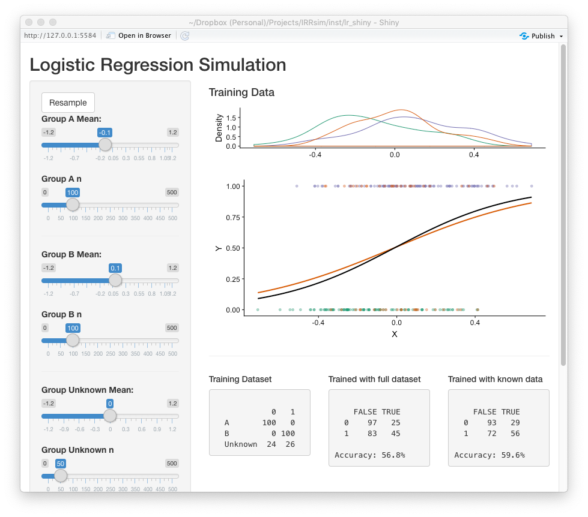

```{r setup, include=FALSE}
knitr::opts_chunk$set(
  collapse = TRUE,
  comment = "#>",
  echo = TRUE,
  message = FALSE,
  warning = FALSE,
  error = FALSE, 
  fig.width=7.5, 
  fig.height=4.5
)
library(IRRsim)

set.seed(2112)
```

```{r, eval=FALSE, echo=FALSE}
# Using Content Summary from DAACS
load(file.choose()) # Load EssayRatings.rda
content_summary <- EssayRatings[!is.na(EssayRatings$Content_Summary),]
table(content_summary$Content_Summary)
table(content_summary$Content_Summary,
			content_summary$Content_Summary1 == content_summary$Content_Summary2)
```

The use of predictive modeling in education for predicting student performance has increase substantially over the last few years (Borray, 2017). Researchers and practitioners estimate, or train, statistical models with student data where the outcome has already been observed so that predictions can be made with new students. In the training process a subset of the data is withheld in order to validate the accuracy of the prediction model. In these models, it is generally assumed the predictors are valid and reliable. Moreover, each observation has equal weight in the modeling process. However, in many situations, researchers may have additional information with regard to the quality, or reliability, of each individual measure. This paper explores the impact of lower quality measures on the accuracy of prediction models, especially when used for scoring students' written work.

Rubrics are common tool for measuring student performance (Moskal & Leydens, 2000). They describe the quality of student work across multiple criteria. On the rubric, each score level has descriptors that describe the quality of response for that score. The result is a student score on an ordinal scale. The reliability of these measures is typically estimated by having multiple raters score the same student work. The score is assumed to reliable and accurate when raters agree. Disagreements are often resolved by either having a third rater score the student work (and taking the average or mode) or have the two raters confer and agree a "true" score. There are numerous reasons why raters may disagree, but regardless of the reason of the disagreement, the disagreement provides valuable information with regard to the quality, or confidence, of the score. 

If we conceptualize rubric scores as the categorization of an underlying, but unmeasured, continuous construct, then the disagreements could be that the actual score is between the scoring levels. One approach would be taking the average of the two raters thereby increasing a *k* level rubric to $2k - 1$ level rubric. However, this us undesirable for predictive modeling since we wish to predict with the same number of levels as training dataset. 

Another perspective is that if rater A scored a student work a one, and rater B scored the same work a two, it is possible the work has qualities (as described in the rubric) of both a one and two. In the situation where written work (e.g. essay) is quantified for use in predictive models (e.g. automated scoring engines), the exclusion of a potential third scoring level could have implications in the accuracy of statistical models predicting new student scores. Regardless, given the disagreement of raters, our confidence that the score is clearly a one or a two is much less that if the raters agreed. 

## Example

The Hewlett Foundations sponsored a Kaggle competition [^1] to advance the accuracy of automated scoring algorithms. Essay set two (see Appendix A) includes responses from 1,800 essays from 10th graders with rubric scores in two domains: writing applications (scores ranging from 1 to 6) and language conventions (scores ranging from 1 to 4). All essays were scored by two raters. Given the rarity of of 1s, 5s, and 6s in domain one and of 1s in domain 2, those essays were excluded leaving 1,682 essays for this analysis. 

[^1]: See https://www.kaggle.com/c/asap-aes for more information on the competition.

LightSIDE (Mayfield & Rosé, 2014) was used to extract text features from the essays (i.e. unigrams, bigrams, include punctuation, stem N-grams, skip stopwords in N-grams). The training set consisted of 70% of the essays randomly selected with the remaining 30% used for validation. A multinomial log-linear regression model was used to train two prediction models: using the entire training set (full model) and using only essays where the two raters agreed (agreement model). The `nnet` (Venables & Ripley, 2002) R (R Core Team, 2019) package was used for to estimate the models. The accuracy for the writing applications domain was 0.7% worse for the agreement model but was better by 5.6% more accurate for the language conventions domain (Table 1).

Table 1. Prediction accuracy

| Domain                   |  Full | Agreement  |
|--------------------------|------:|-----------:|
| 1. Writing Applications  | 63.9% |   63.1%    |
| 2. Language Conventions  | 55.7% |   61.3%    |

## Research Questions

Given the differences in model accuracy for differing data, this paper is guided by the following research question: What is the impact of rater disagreements on the accuracy of predicting scores?


## Method

To explore the impact of lower confidence scores on predictive models, data will be simulated with a single quantitative predictor variable for a dichotomous outcome variable. For the predictor variable, three groups will be simulated from a random normal distribution with separate means but equivalent standard deviations. Group A with an outcome of 0, Group B with an outcome of 1, and Group Unknown with a random outcome with specified probability of outcome (the default is 50% for each outcome). Group sizes can be specified, but are $n_A = 100$, $n_B = 100$, and $n_{unknown} = 50$ by default. The `simulatePredictionData` function in the `IRRsim` R package facilitates the simulation of the data matrix. The following will generate two data frames for training and validating the predictive models.

```{r, echo=TRUE}
test1.train <- simulatePredictionData(
	mean1 = -0.1, n1 = 100,
    mean2 = 0.1, n2 = 100,
    mean_unknown = 0.0, n_unknown = 50, ratio_unknown = 0.5,
    sd = .2)
table(test1.train$Y, test1.train$Group)
test1.valid <- simulatePredictionData(
	mean1 = -0.1, n1 = 100,
    mean2 = 0.1, n2 = 100,
    mean_unknown = 0.0, n_unknown = 50, ratio_unknown = 0.5,
    sd = 0.2)
table(test1.valid$Y, test1.valid$Group)
```

Logistic regression is used to train two predictive model using the `glm` function in R: 1. Using all data in the training set and 2. Only data from groups A and B, thereby excluding the uncertain group which has a random outcome.

```{r, eval=TRUE}
uncertain_label <- attr(test1.valid, 'labels')[3]
test1.lr.full <- glm(Y ~ X, 
                     data = test1.train, 
                     family = binomial(link = 'logit'))
test1.lr.known <- glm(Y ~ X, 
                      data = test1.train[test1.train$Group != uncertain_label,], 
                      family = binomial(link = 'logit'))
test1.valid$Fitted.Full <- predict(test1.lr.full, newdata = test1.valid)
test1.valid$Fitted.Known <- predict(test1.lr.known, newdata = test1.valid)
```

Figure 1 represents the distributions of the predictor variable for each group separately along with the fitted logistic regression using all the data in black and using only groups A and B in orange. This is a fairly large effect of the predictor with a standardized difference of 1.0 between groups A and B. The mean for the uncertain group in this example fall in the middle and has equal likelihood of an outcome of 0 or 1.


```{r, echo=FALSE, fig.cap="Figure 1. Logistic Regression Plot", fig.height=5}
plot(test1.train, title = '')
```

The accuracy of the predictions using the model trained with all the data is `r round(sum(test1.valid$Y == (test1.valid$Fitted.Full > 0.5)) / nrow(test1.valid) * 100)`% and for the model trained with only groups A and B is `r round(sum(test1.valid$Y == (test1.valid$Fitted.Known > 0.5)) / nrow(test1.valid) * 100)`%. The `simulateLR` function will facilitate simulating, training, and validating many datasets (500 by default) with the same parameters.

```{r, echo=TRUE, cache=TRUE, results='hide'}
test1 <- simulatePredictionModels(
	mean1 = -0.1, n1 = 100,
	mean2 = 0.1, n2 = 100,
	mean_unknown = 0.0, n_unknown = 50, ratio_unknown = 0.5,
	sd = .2)
```

## Results

Figure 2 is a histogram of the differences in prediction accuracies in the validation dataset between the models trained with all data minus models trained excluding the disagreements. On average, training the model with only agreement scores resulted in an `r ifelse(mean(test1$accuracy.difference) < 0, 'increase', 'decrease')` accuracy of `r abs(round(mean(test1$accuracy.difference)*100, digits = 2))`%.

```{r, fig.height=3.0, echo=FALSE, fig.cap='Figure 2. Distribution of differences in prediction accuracies.'}
ggplot(test1, aes(x = accuracy.difference)) +
	geom_vline(xintercept = 0) +
	geom_histogram(alpha = 0.6, binwidth = 0.01) + 
	ylab('Number of Samples') +
	xlab('Difference in Accuracy (Full - Agree)')
```


```{r, eval=FALSE, echo=FALSE, cache=TRUE, results='hide', fig.height=3.0}
test2 <- simulatePredictionModels(
	mean1 = -0.1, n1 = 52, mean2 = 0.1, n2 = 88, sd = 0.2, 
	mean_unknown = 0.0, n_unknown = 184, ratio_unknown = 0.37)
head(test2)
ggplot(test2, aes(x = accuracy.difference)) +
	geom_vline(xintercept = 0) +
	geom_histogram(alpha = 0.6, binwidth = 0.01) + 
	ylab('Number of Samples') +
	xlab('Difference in Accuracy (Full - Agree)')
```

```{r, eval=FALSE, echo=FALSE, cache=TRUE, results='hide', fig.height=3.0}
test3 <- simulatePredictionModels(
	mean1 = -0.1, n1 = 52, mean2 = 0.1, n2 = 88, 
	mean_unknown = 0.0, n_unknown = 184, ratio_unknown = 0.42)
# head(test3)
ggplot(test3, aes(x = accuracy.difference)) +
	geom_vline(xintercept = 0) +
	geom_histogram(alpha = 0.6, binwidth = 0.01) + 
	ylab('Number of Samples') +
	xlab('Difference in Accuracy (Full - Agree)')
```

## Discussion

The reliability of measures used in predictive modeling are an important contributor to the overall accuracy of the model. The inclusion and exclusion of data in training datasets is an important consideration for researhers and practioners. The impact of disagreement, or uncertain scores on the accuracy of predictive models will vary depending on the data available. To assist practioners in estimatin the impact of uncertain scores on the accuracy of predictive models, an R Shiny (Chang et al, 2019) application was developed (Figure 3).[^2] This application simulates many datasets using the parameters specified by the user providing model accuracy estimates using all and agreement data.

[^2]: The following function will run the Shiny application: `IRRsim::LRsim_demo()` 



*Figure 3.* Screenshot of the prediction model simulation Shiny application


## References

Borray, A. (2017). Predicting Student Success with Big Data. *EducauseReview*. Retrieved from https://er.educause.edu/blogs/2017/4/predicting-student-success-with-big-data

Chang, W., Cheng, J., Allaire, J.J., Xie, Y. & McPherson, J. (2019). shiny: Web Application Framework for R. R package version 1.3.2.
  
Mayfield, E., & Rosé, C.P. (2014). LightSIDE: Open source machine learning. In M.D. Shermis and J. Burstein (Eds.), *Handbook of Automated Essay Evaluation: Current Applications and New Directions* (pp. 124-135). New York: Routledge.

Moskal, B.M., & Leydens, J.A. (2000). Scoring rubric development: Validity and reliability. *Practical Assessment, Research, & Evaluation, 7*(10).

R Core Team (2019). *R: A language and environment for statistical computing.* R Foundation for Statistical Computing, Vienna, Austria. URL https://www.R-project.org/.
  
Shermis, M.D., & Hamner, B. (2012). *Contrasting state-of-the-art automated scoring of essays: analysis.* Paper presented at the National Council on Measurements in Education, 2012, Vancouver, BC.

Venables, W. N. & Ripley, B. D. (2002), *Modern Applied Statistics with S.* Fourth Edition. Springer, New York.
  
## Appendix A: Essay Prompt and Rubric

**Essay Prompt**

Censorship in the Libraries

"All of us can think of a book that we hope none of our children or any other children have taken off the shelf. But if I have the right to remove that book from the shelf -- that work I abhor -- then you also have exactly the same right and so does everyone else. And then we have no books left on the shelf for any of us." --Katherine Paterson, Author

Write a persuasive essay to a newspaper reflecting your vies on censorship in libraries. Do you believe that certain materials, such as books, music, movies, magazines, etc., should be removed from the shelves if they are found offensive? Support your position with convincing arguments from your own experience, observations, and/or reading.

**Scoring Rubric**


